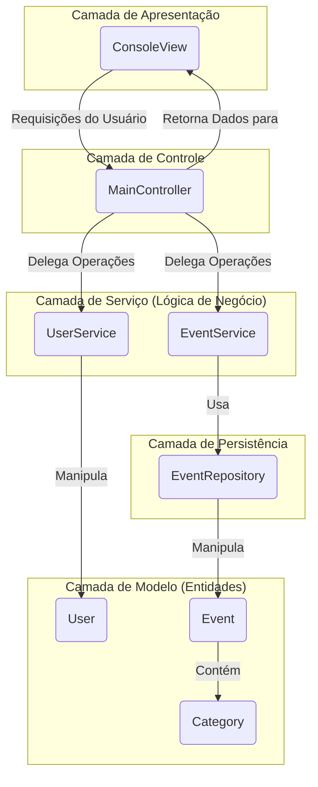

# 👨‍🎓 Projeto Acadêmico | Universidade São Judas

Este é o meu primeiro projeto acadêmico desenvolvido em Java, com o objetivo de aplicar conceitos de Orientação a Objetos e arquitetura de software em uma aplicação de console.

# ☕ Sistema de Gerenciamento de Eventos (Core Java)

Este projeto é uma aplicação de console (CLI) desenvolvida em Java puro para o gerenciamento de eventos, focada em boas práticas de arquitetura de software e manutenibilidade.

## 📜 Descrição

A solução implementa funcionalidades de **CRUD** para eventos e usuários, além de lógicas para consulta e participação. O design do sistema prioriza a **Separação de Responsabilidades (SoC)** e a manutenibilidade do código, utilizando uma arquitetura em camadas e o paradigma de Orientação a Objetos.

## 🏛️ Arquitetura e Padrões de Projeto

A arquitetura do sistema é inspirada no padrão **MVC (Model-View-Controller)**, adaptado para uma aplicação de console, e segue os princípios de uma **Arquitetura em Camadas (Layered Architecture)**.

  - **Model**: Representa as entidades de domínio (`User`, `Event`) e enums (`Category`). São objetos POJO que carregam os dados da aplicação.
  - **View**: A `ConsoleView` é responsável exclusivamente pela interação com o usuário (I/O). Ela não contém regras de negócio.
  - **Controller**: O `MainController` atua como o orquestrador do fluxo da aplicação, recebendo requisições da View e delegando as operações para a camada de Serviço.
  - **Service**: A camada de serviço (`EventService`, `UserService`) encapsula a lógica de negócio da aplicação.
  - **Repository**: A camada de persistência (`EventRepository`) abstrai o acesso aos dados, desacoplando a lógica de negócio dos detalhes de armazenamento.

### Diagrama da Arquitetura



## 📂 Estrutura do Projeto

O código-fonte está modularizado em pacotes que representam as camadas da arquitetura:

```
src/
├── main/            # Ponto de entrada da aplicação (App.java)
├── controller/      # Orquestra o fluxo de dados
├── model/           # Contém as classes de domínio (entidades)
├── view/            # Responsável pela interface de linha de comando
├── service/         # Implementa as regras de negócio do sistema
└── repository/      # Abstrai o acesso e a manipulação da fonte de dados
```

## 💾 Persistência de Dados

Para a persistência dos dados, foi utilizada a **Serialização de Objetos Java**.

  - **Implementação**: A lista de objetos `Event` é serializada e salva em um arquivo binário (`events.data`).
  - **Justificativa**: Esta abordagem foi escolhida por sua simplicidade e por não exigir dependências externas (como um SGBD), sendo adequada para o escopo do projeto.
  - **Limitações**: A serialização nativa pode apresentar desafios de versionamento e não é performática para grandes volumes de dados ou acesso concorrente.

## 🔧 Tecnologias e APIs

  - **Linguagem**: Java (JDK 8+)
  - **APIs Core**:
      - `java.time (JSR-310)`: Para manipulação precisa de datas e horas (`LocalDateTime`).
      - `java.io`: Para serialização de objetos e manipulação de arquivos.
      - `java.util.stream`: Utilizada para processamento declarativo e funcional de coleções.
      - `java.util.UUID`: Para geração de identificadores únicos para as entidades.

## 🚀 Como Compilar e Executar

### Via IDE

1.  Importe o projeto em sua IDE preferida (Eclipse, IntelliJ IDEA, etc.).
2.  Localize a classe `main.App.java`.
3.  Execute o método `main()` para iniciar a aplicação.

### Via Linha de Comando

1.  Navegue até a pasta `src` do projeto.
2.  Compile todos os arquivos `.java` e direcione os `.class` para uma pasta `bin`:
    ```bash
    javac -d ../bin */*.java
    ```
3.  Navegue até a pasta `bin`:
    ```bash
    cd ../bin
    ```
4.  Execute a aplicação:
    ```bash
    java main.App
    ```

## 🌱 Possíveis Melhorias

  - [ ] **Refatorar a Persistência**: Substituir a serialização por um banco de dados (H2, SQLite, PostgreSQL) com JDBC ou JPA/Hibernate.
  - [ ] **Testes**: Implementar testes unitários e de integração com JUnit e Mockito.
  - [ ] **Gerenciamento de Dependências**: Adotar Maven ou Gradle para automatizar o build e gerenciar dependências.
  - [ ] **API REST**: Expor as funcionalidades através de uma API RESTful com Spring Boot.
  - [ ] **Interface Gráfica**: Desenvolver uma GUI com JavaFX/Swing ou uma UI Web com React/Angular consumindo a API.
